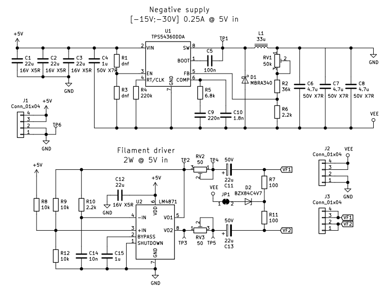

# Power supply for VFD

## Features

Main parts of the VFD power supply: inverting buck-boost converter (supposed to use with ICs like PT6311 and etc) and filament driver.

Inverting converter:

* Input voltage: 5V
* Output negative voltage: -15V to -30V
* Output current: 250mA @ 5V in

Filament driver:

* Input voltage: 5V
* Output voltage: 5 to 0 (dummy resistors to regulate)
* Output power: 2W @ 5V in

## Board

Schematic and pcb layout created in KiCad 6 Nightly Build (compatible with KiCad 5).

